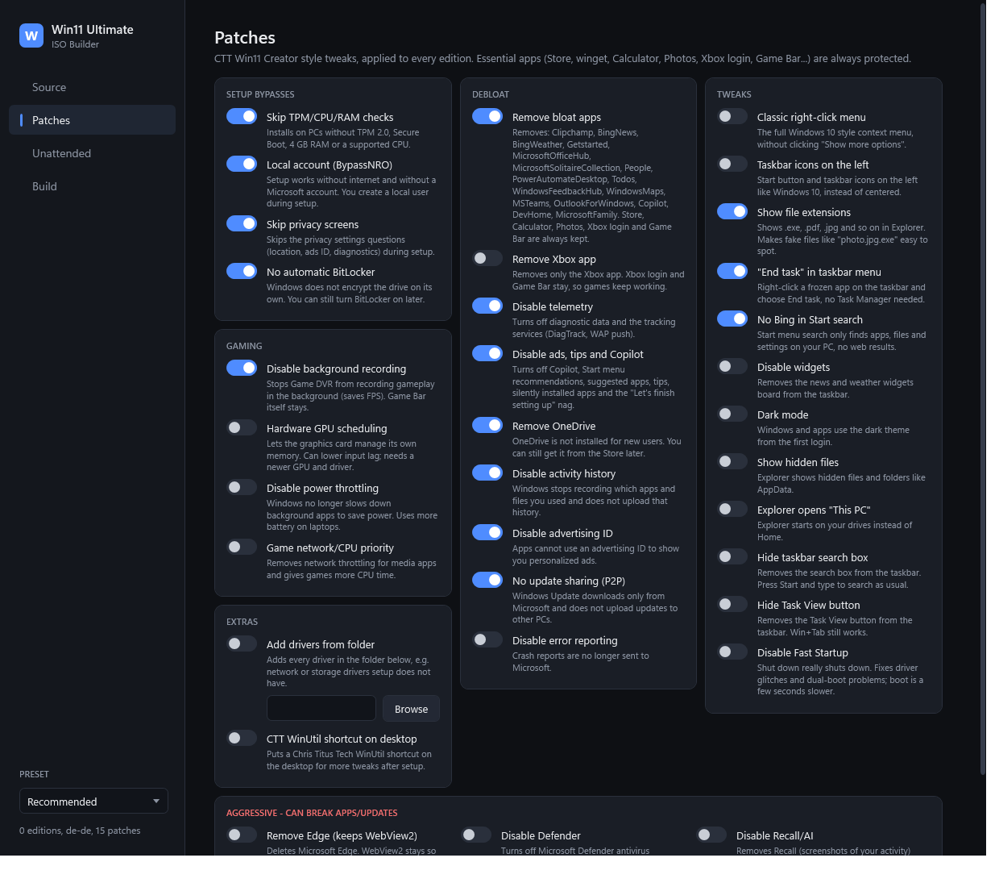

# Win11 Ultimate ISO Builder

Build **one Windows 11 ISO** with the editions you want, in the language of your choice,
[CTT WinUtil](https://github.com/ChrisTitusTech/winutil) Win11 Creator-style patches and an optional unattended setup,
all from a dark, point-and-click GUI.



## Install

Open PowerShell and run:

```powershell
irm https://raw.githubusercontent.com/nussico/win11-ultimate-iso/main/install.ps1 | iex
```

It asks which drive to use (Enter = the drive it is already on, or the one with the most free space), downloads the
builder to `Win11UltimateBuilder` there and starts it as admin.
Next time, start it with the *Win11 Ultimate ISO Builder* shortcut in that folder (nothing is added to Start menu or desktop). When a new version is out, an **Update available** button shows in the top bar:
one click updates and restarts. Your ISOs, output and cache are kept.

Manual: download the repo ZIP, extract, right-click `Builder.ps1` -> *Run with PowerShell*.

## Features

- **Always newest**: picks the newest general Windows 11 release (today 26H2) and downloads it if your ISO is an older version.
- **Fast mode** (default): UUP downloads skip merging the latest update (~15 min instead of ~60). The ISO then holds the older base build (e.g. 26100) and Windows Update brings it up to date after setup; turn it off once for a fully current ISO. Downloaded ISOs are kept in `sources` and reused, so later builds skip the download either way.
- **Sources**: your own official ISOs, and/or automatic download through [UUP dump](https://uupdump.net)
  (Home, Pro, Education, Enterprise).
- **Language**: one language per ISO (setup and Windows); more can be added later in Windows Settings.
- **Presets**: Basic, Recommended, CTT, Extreme, or tick everything yourself.
- **Patches**
  - Setup: TPM / Secure Boot / RAM / CPU checks, local account, skip privacy screens, no auto-BitLocker
  - Apps: preinstalled bloat, Xbox app, OneDrive. Essential apps (Store, winget, Calculator, Photos, Xbox login, Game Bar...) are protected
  - Privacy: telemetry, ads/tips/Copilot, activity history, advertising ID, error reporting, Bing in Start, typing data, tailored experiences
  - Taskbar & Start: icons on the left, End task, hide search box / Task View / widgets, more Start pins, clock seconds
  - Explorer: classic right-click menu, file extensions, hidden files, open This PC, compact view, hide Gallery
  - System: dark mode, no Fast Startup, no hibernation, long paths, services to manual (CTT)
  - Updates: no P2P sharing, no driver updates, no automatic restart
  - Gaming: no background recording, GPU scheduling, no power throttling, game priority, no mouse acceleration, no Sticky Keys popup
  - Aggressive: remove Edge (keeps WebView2), disable Defender, disable Recall
  - Extras: inject drivers, CTT WinUtil shortcut
- **Unattended**: local account (default `User`), timezone, keyboard, skip OOBE, product key, run WinUtil or your own script after first login.
- **Apps**: search winget in the builder and add apps (Steam, Discord, Firefox...); they install automatically after the first login.
- **Version stamp**: every ISO is named `W11U_<version>` (shown in Explorer and on the USB stick) and has a `Win11Ultimate.txt` saying which builder version made it and with which editions and patches.
- **Build plan**: the Build page shows what will happen before you start (reuse or download, time, disk space). Taskbar progress, and the window flashes when done.
- **Storage**: sizes of ISOs, builds and leftovers; *Clean up* deletes temp files and outdated downloads (never your own ISOs).
- **Test in VM**: one click creates a Hyper-V VM (no TPM, so it tests the bypasses) that boots the built ISO.
- **Automatic install**: *Best SSD* picks the one clear best internal disk (NVMe > SSD > HDD, never USB) with a 10 s cancel countdown, otherwise normal setup opens.

## Requirements

Windows 10/11, admin rights, about 60 GB free disk space, internet for UUP dump.
The first build installs the Windows ADK *Deployment Tools* via winget.

## Presets

| Preset | Patches |
|---|---|
| Basic | setup bypasses |
| Recommended | + bloat apps and OneDrive (keeps the Xbox app), privacy, file extensions, End task, no auto-restart, no background recording |
| CTT | + CTT's UI tweaks, services to manual, WinUtil shortcut; unattended: skip OOBE, run WinUtil |
| Extreme | everything incl. Edge / Defender / Recall and the Xbox app |

## Testing a build

```powershell
powershell -File tests\SelfTest.ps1      # logic checks, no admin needed
powershell -File tests\Test-Build.ps1    # checks out\Win11.iso (admin)
```

Then click **Test in VM** on the Build page (needs Hyper-V) and install it there.

## Known limits

- Cancel takes effect between steps; a running DISM operation finishes first, then everything is unmounted and discarded.
- *Best SSD* auto-install needs UEFI; on legacy BIOS the normal setup opens.
- Activation: use your own key or the PC's existing digital license. No activation tools are included.

## Disclaimer

Not affiliated with Microsoft, Chris Titus Tech or UUP dump. Aggressive patches and automatic install can break things
or erase disks. Use at your own risk.

## License

[MIT](LICENSE)
